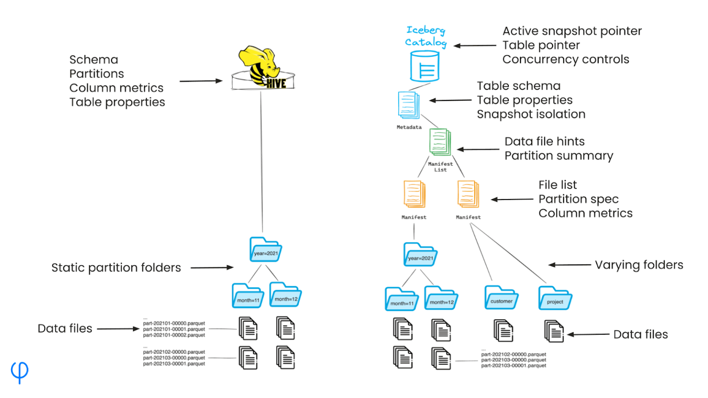
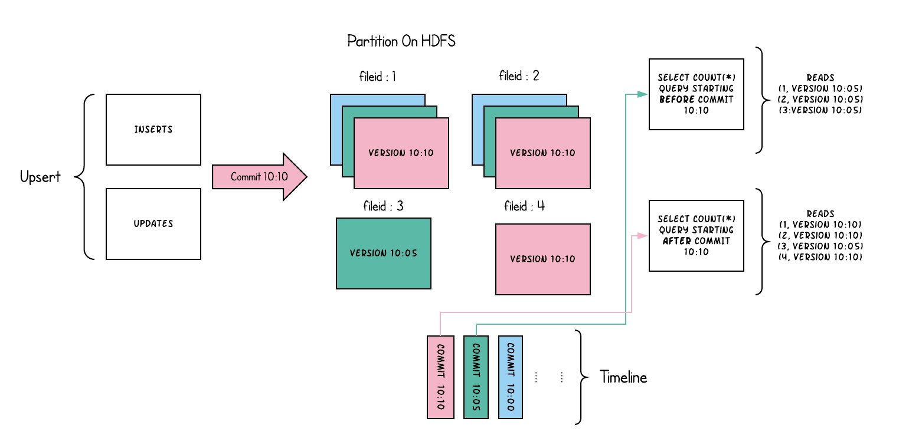

---
tags:
  - data_formats
  - columnar
  - row_based
  - parquet
  - orc
  - predicate_pushdown
  - schema_evolution
  - compression
  - ACID
  - time_travel
  - delta_lake
  - iceberg
  - hudi
  - metadata

---
### Links
- [[complex_data_formats]]
- [[basic_formats]]
- [[row_based_and_columnar_formats]]

### Definition

# Форматы данных в Big Data: Комплексные табличные форматы

Комплексные, высокоуровневые форматы (Complex/Table Formats) — это не отдельные форматы, а **<u>мета-слой</u>** над файлами (**«Git для файлов»**), высокоуровневые форматы, которые обеспечивают:

1. ACID, 
2. schema evolution, 
3. time travel, 
4. возможность делать UPDATE/DELETE/MERGE.

## Комплексные форматы (Table Formats)

### Delta Lake

Разработан Databricks, добавляет слой метаданных поверх Parquet для поддержки ACID-транзакций и управления данными в озере данных.

#### Основные характеристики:

- **ACID-транзакции**: Гарантирует атомарность, согласованность, изоляцию и долговечность.
- **Эволюция схемы**: Поддерживает изменения схемы без переписывания данных.
- **Путешествие во времени (Time Travel)**: Позволяет запрашивать данные на определенный момент времени или версию.
- **Журнал транзакций (Delta Log)**: Хранит историю операций для обеспечения надежности.

#### Как устроен Delta Lake?

Когда ты создаёшь Delta-таблицу, создаётся структура папки:

- **\_delta_log/** — журнал изменений. Хранятся логи всех операций (insert, update, delete). Каждый лог-файл — это JSON или Parquet, содержащий -&gt; какие файлы добавлены; какие удалены; какая схема, партиционирование, и т.д.
- **part-\*.parquet** — сами данные. Это просто обычные Parquet-файлы. Хранят данные в колонках, эффективно и сжато.

#### Преимущества:

- Надежность и согласованность данных в озерах данных.
- Поддержка пакетной и потоковой обработки в Spark.
- Упрощает управление данными (удаление, обновление, слияние).

#### Недостатки:

- Привязка к Parquet как основному формату хранения.
- Ограниченная поддержка вне экосистемы Databricks/Spark.
- Накладные расходы на метаданные при мелких обновлениях.

#### Сценарии использования:

- Озера данных с требованиями к транзакционной целостности.
- Аналитика и машинное обучение в Spark.
- Сценарии с частыми обновлениями и версионированием данных.

### Apache Iceberg

Открытый табличный формат, разработанный Netflix, для управления большими аналитическими таблицами с поддержкой гибкого партиционирования и эволюции схемы.

#### Основные характеристики:

- **Скрытое партиционирование**: Упрощает управление партициями, автоматически оптимизируя запросы.

**Схема**: 

*На схеме показано ключевое отличие Apache Iceberg от традиционного Hive-стиля хранения данных — логическое (гибкое) партиционирование против жёсткой структуры папок.*

***Слева — Hive-таблицы со статическим партиционированием****:*

*Каждая партиция — это отдельная папка на файловой системе. Например: .../year=2021/month=11/part-xxxx.parquet.*

*Hive читается только по этим путям, сканируя нужные папки.*

***Недостатки****: Статичная структура: если ты хочешь изменить схему партиционирования, придётся пересоздавать таблицу.*

***Справа — Apache Iceberg: партиции через метаданные****:*

*Iceberg использует слои метаданных, которые содержат:*

- ***Catalog*** *— указатель на активный снапшот, контроль версий, изоляция транзакций.*
- ***Metadata*** *— схема таблицы, свойства, информация о снапшотах.*
- ***Manifest List*** *— список файлов и их партиций, собранный по снапшоту.*
- ***Manifest*** *— список конкретных файлов + партиционные колонки + статистика колонок.*

***Суть****: Iceberg НЕ зависит от структуры папок. Т.е. файлы могут лежать в любых папках. Партиционирование — логическое, управляется через манифесты.*

- **Эволюция схемы**: Поддерживает изменения схемы и партиций без переписывания данных.
- **Изоляция снимков (Snapshot Isolation)**: Позволяет работать с разными версиями таблицы одновременно. 
*У тебя есть таблица, в которую постоянно добавляют новые записи, обновляют старые, удаляют неактуальные. Каждый раз, когда ты совершаешь транзакцию (insert, update, delete), Iceberg НЕ изменяет старые файлы напрямую. Вместо этого — создаёт новую версию таблицы с новыми файлами или ссылками на существующие. Эта версия = новый снапшот.*
  - *Что это даёт тебе как аналитику?*
    - **Time travel** — ты можешь выполнить запрос: `SELECT * FROM my_table AS OF TIMESTAMP '2025-08-01 10:10'`.
    - **Безопасное чтение во время записи** — потому что каждый читатель "видит" только определённый снапшот.

      Каждый снапшот знает: какие data files использовать; какие partition и schema применимы; какие манифесты (manifests) у него есть.
    - **Откат изменений** — ты можешь откатиться к предыдущему снапшоту, как в Git.
- **Поддержка форматов**: Работает с Parquet, ORC и Avro.

#### Как устроена таблица Iceberg?

- **Таблица Iceberg**:
  - **Метаданные (metadata.json)** — содержит схему, партиции, снапшоты.
  - **Снапшоты (snapshots)** — состояния таблицы в разное время. Каждый указывает на список манифестов.
  - **Манифесты (manifests)** — списки data-файлов. Указывают, какие parquet-файлы входят в снапшот.
  - **Данные (data/)** — обычные Parquet, Avro или ORC файлы.
- **Главное отличие от Delta**: Iceberg не использует лог-файлы, как Delta, а вместо этого — дерево версий, как Git.

#### Пример изменений:

Ты добавляешь новый файл data-002.parquet. Iceberg создаёт новый manifest (список файлов). Создаётся новый snapshot — теперь он «указывает» на новые файлы. Старый snapshot никуда не делся → можно вернуться назад -&gt; то есть у него имеется **Partition evolution**.

#### Где Iceberg особенно силён?

- Большие lake-хранилища.
- Частые чтения, но нечастые изменения.
- Интеграция с разными движками (Trino, Snowflake, Flink, Spark).

#### Недостатки Iceberg:

- Немного сложнее в настройке. Нужно понять, как работают каталоги и снапшоты.
- Нет встроенных индексов. Нет Bloom-фильтров, как в Hudi.
- Медленнее при частых обновлениях. Не для случаев, где данные быстро меняются.
- Молодой формат в проде. Некоторые фичи ещё экспериментальные.

### Apache Hudi

Разработан Uber, для инкрементальной обработки и управления данными с поддержкой обновлений на уровне записей. Apache Hudi — это табличный формат поверх data lake, ориентированный на:

- частые изменения данных;
- быструю запись (insert/update/delete);
- работу в режиме near real-time (почти в реальном времени).

Если у тебя часто приходят новые данные или нужно обновлять существующие записи — Hudi тебе подойдёт больше, чем Delta или Iceberg.

#### Основные характеристики:

- **Инкрементальная обработка**: Поддерживает обновления и удаления с минимальными затратами. Инкрементальная обработка означает, что система обрабатывает только новые или измененные данные (дельту), а не весь набор данных целиком.
- **Обновления на уровне записей**: Позволяет выполнять UPSERT и DELETE на уровне строк.
- **Хронология (Timeline Service)**: Хранит историю изменений для отслеживания операций.
- **Типы таблиц (режимов)**:
  - **Copy-on-Write (COW)**: Переписывает файлы при обновлении (Parquet).
    - **Подходит для**:
      - Чтения с высокой производительностью (файлы уже “сложены” как надо).
      - Редких обновлений (вставок много, но обновлений — немного).
    - **Минусы COW**:
      - Медленные обновления: приходится перезаписывать целый файл даже для одной строки.
      - Высокая нагрузка на I/O.
    - **Применение COW**:
      - Data Lake для аналитики, где важна скорость чтения.
      - Пример: логика обработки кликов, IoT, telemetry, где чаще вставляют, чем обновляют.
  - **Merge-on-Read (MOR)**: Хранит обновления в дельта-файлах (Avro) с периодической компактификацией.

    *Компактификация — объединение множества мелких файлов данных или логов изменений (например, в Hudi Merge-on-Read или Delta Lake) в меньшее количество более крупных файлов, чтобы улучшить производительность чтения, уменьшить накладные расходы на метаданные и оптимизировать хранение.*
    - **Преимущества MOR**:
      - Быстрые записи и обновления: не нужно каждый раз переписывать base-файл.
      - Эффективно при частых апдейтах.
    - **Минусы MOR**:
      - Чтение медленнее, потому что требует слияния (merge) данных из разных файлов.
      - Нужно больше CPU при чтении.
- **Индексация в Hudi**:
  - Hudi поддерживает индексы, чтобы быстро находить нужные записи при обновлениях:
    - **Bloom Index** (по умолчанию): быстро ищет нужный файл, где есть ключ.
    - **Global vs Local Index**.
    - **Simple Index, Bucket Index** и другие.

      Это то, чего нет в Delta и Iceberg на уровне самого формата.

#### Схема:

**Левая часть — вставка и обновление данных**:

Здесь указаны операции: INSERTS (вставки) и UPDATES (обновления).

Эти изменения фиксируются (commit) в момент времени 10:10 — это "версия" данных.

**Центр — разные версии данных**:

После коммита создаётся новая версия данных: VERSION 10:10.

Также хранятся старые версии: например, VERSION 10:05 и VERSION 10:00.

Hudi хранит несколько версий, чтобы обеспечить консистентность при чтении (механизм "time travel").

**Правая часть — чтение данных (queries)**:

Есть два запроса SELECT COUNT(\*), которые начинаются в разное время:

- **Запрос, начатый до коммита 10:10**: Использует старую версию данных — например, 10:05. Это позволяет получить консистентный срез, несмотря на то, что данные уже обновились.
- **Запрос, начатый после коммита 10:10**: Видит уже новую версию данных — 10:10. Он включает последние INSERT и UPDATE.

**Зачем это нужно?** Это реализует MVCC (Multi-Version Concurrency Control) — механизм, позволяющий:

- Писать и читать данные одновременно.
- Обеспечивать согласованность.
- Работать с "прошлыми" снапшотами данных.

#### Hudi подходит:

- CDC (Change Data Capture).
- Логирование событий.
- ETL/ELT пайплайны, которые постоянно обновляют данные.
- Streaming ingestion в real-time.

#### Hudi не лучший выбор для:

- Только append-only данные (проще взять Delta/Iceberg).
- Сложные join'ы (т.к. log-файлы не так быстро читаются).

#### Итог:

**Преимущества**:

- Эффективен для потоковой обработки и частых обновлений.
- Поддержка реального времени в озерах данных.
- Интеграция с Spark, Flink и Presto.

**Недостатки**:

- Сложность управления MOR-таблицами (требуется компактификация).
- Ограниченная поддержка форматов (в основном Parquet и Avro).
- Высокая сложность настройки по сравнению с Delta Lake.

**Сценарии использования**:

- Потоковые озера данных с частыми обновлениями.
- Сценарии реального времени (например, аналитика поездок в Uber).
- Инкрементальные ETL-процессы.

### Resources
https://www.ibm.com/think/topics/delta-lake

https://www.dremio.com/resources/guides/apache-iceberg/

https://www.onehouse.ai/blog/apache-hudi-vs-delta-lake-vs-apache-iceberg-lakehouse-feature-comparison

---
tags:
  - data_formats
  - columnar
  - row_based
  - parquet
  - orc
  - predicate_pushdown
  - schema_evolution
  - compression
  - ACID
  - time_travel
  - delta_lake
  - iceberg
  - hudi
  - metadata
---

### Links
- [[complex_data_formats]]
- [[basic_formats]]
- [[row_based_and_columnar_formats]]

### Definition
Complex table formats in Big Data (*Delta Lake*, *Iceberg*, *Hudi*) are not standalone formats but a **<u>meta-layer</u>** over files (**"Git for files"**). These high-level formats provide:

1. ACID transactions,
2. Schema evolution,
3. Time travel,
4. Support for UPDATE/DELETE/MERGE operations.

Complex, high-level formats (Table Formats) are a **<u>meta-layer</u>** over files, providing:

1. ACID transactions,
2. Schema evolution,
3. Time travel,
4. Support for UPDATE/DELETE/MERGE operations.

## Complex Formats (Table Formats)

### Delta Lake

Developed by Databricks, Delta Lake adds a metadata layer over Parquet to support ACID transactions and data management in data lakes. #delta_lake

#### Key Features:

- **ACID Transactions**: Ensures atomicity, consistency, isolation, and durability.
- **Schema Evolution**: Supports schema changes without rewriting data.
- **Time Travel**: Allows querying data at a specific point in time or version.
- **Transaction Log (Delta Log)**: Stores the history of operations for reliability.

#### How Delta Lake Works

When you create a Delta table, a folder structure is generated:

- **_delta_log/**: Stores the transaction log, capturing all operations (insert, update, delete). Each log file is in JSON or Parquet format, detailing which files were added, removed, the schema, partitioning, etc.
- **part-*.parquet**: The actual data, stored as standard Parquet files, organized in columns efficiently with compression.

#### Advantages:

- Reliability and data consistency in data lakes.
- Supports both batch and streaming processing in Spark.
- Simplifies data management (deletion, updating, merging).

#### Disadvantages:

- Tied to Parquet as the underlying storage format.
- Limited support outside the Databricks/Spark ecosystem.
- Metadata overhead for small updates.

#### Use Cases:

- Data lakes requiring transactional integrity.
- Analytics and machine learning in Spark.
- Scenarios with frequent updates and data versioning.

### Apache Iceberg

An open table format developed by Netflix for managing large analytical tables with flexible partitioning and schema evolution. #iceberg

#### Key Features:

- **Hidden Partitioning**: Simplifies partition management by automatically optimizing queries.

**Diagram**:

*The diagram illustrates the key difference between Apache Iceberg and traditional Hive-style data storage: logical (flexible) partitioning versus rigid folder structures.*

***Left: Hive tables with static partitioning***:

*Each partition is a separate folder in the file system, e.g., .../year=2021/month=11/part-xxxx.parquet.*

*Hive reads data only by scanning these folder paths.*

***Disadvantages***: Static structure; changing the partitioning schema requires recreating the table.

***Right: Apache Iceberg with metadata-based partitioning***:

*Iceberg uses metadata layers, including:*

- ***Catalog***: Points to the active snapshot, manages versioning, and ensures transaction isolation.
- ***Metadata***: Stores table schema, properties, and snapshot information.
- ***Manifest List***: Lists files and their partitions for a given snapshot.
- ***Manifest***: Lists specific data files, partition columns, and column statistics.

***Essence***: Iceberg does not rely on folder structures. Files can reside in any folder, with partitioning managed logically through manifests.

- **Schema Evolution**: Supports schema and partition changes without rewriting data.
- **Snapshot Isolation**: Enables working with multiple table versions simultaneously.

*When you have a table with frequent additions, updates, or deletions, Iceberg does not directly modify old files. Instead, it creates a new table version with new files or references to existing ones, forming a new snapshot.*

- *What does this provide for analysts?*
  - **Time Travel**: Query data as of a specific timestamp, e.g., `SELECT * FROM my_table AS OF TIMESTAMP '2025-08-01 10:10'`.
  - **Safe Reads During Writes**: Readers see only a specific snapshot, ensuring consistency.
  - **Change Rollback**: Revert to a previous snapshot, similar to Git.

  *Each snapshot knows which data files to use, which partitions and schema apply, and which manifests are included.*
- **Format Support**: Works with Parquet, ORC, and Avro.

#### How an Iceberg Table Works

- **Iceberg Table**:
  - **Metadata (metadata.json)**: Contains schema, partitions, and snapshots.
  - **Snapshots**: Table states at different times, each pointing to a list of manifests.
  - **Manifests**: Lists of data files, indicating which Parquet, Avro, or ORC files belong to a snapshot.
  - **Data (data/)**: Standard Parquet, Avro, or ORC files.
- **Key Difference from Delta**: Iceberg uses a version tree (like Git) instead of Delta's log files.

#### Example of Changes:

When you add a new file, `data-002.parquet`, Iceberg creates a new manifest (file list) and a new snapshot pointing to the updated files. The old snapshot remains, enabling rollback to previous states, supporting **partition evolution**.

#### Where Iceberg Excels:

- Large data lake storage.
- Frequent reads with infrequent changes.
- Integration with various engines (Trino, Snowflake, Flink, Spark).

#### Disadvantages:

- Complex setup, requiring understanding of catalogs and snapshots.
- No built-in indexes or Bloom filters, unlike Hudi.
- Slower for frequent updates, not ideal for rapidly changing data.
- Relatively new in production, with some experimental features.

### Apache Hudi

Developed by Uber for incremental processing and data management with record-level updates. Apache Hudi is a table format over data lakes, optimized for:

- Frequent data changes.
- Fast writes (insert/update/delete).
- Near real-time processing.

Hudi is ideal when new data arrives frequently or existing records need updating, outperforming Delta or Iceberg in such scenarios. #hudi

#### Key Features:

- **Incremental Processing**: Supports updates and deletions with minimal overhead. Incremental processing handles only new or changed data (delta) rather than the entire dataset.
- **Record-Level Updates**: Enables UPSERT and DELETE operations at the row level.
- **Timeline Service**: Tracks the history of changes for operation auditing.
- **Table Types**:
  - **Copy-on-Write (COW)**: Rewrites files during updates (using Parquet).
    - **Suitable for**:
      - High-performance reads (files are pre-consolidated).
      - Infrequent updates (many inserts, few updates).
    - **COW Disadvantages**:
      - Slow updates, as entire files are rewritten even for a single row.
      - High I/O load.
    - **COW Use Cases**:
      - Data lakes for analytics where read speed is critical.
      - Examples: Clickstream processing, IoT, telemetry, where inserts dominate over updates.
  - **Merge-on-Read (MOR)**: Stores updates in delta files (Avro) with periodic compaction.

    *Compaction merges multiple small data or log files (e.g., in Hudi Merge-on-Read or Delta Lake) into fewer, larger files to improve read performance, reduce metadata overhead, and optimize storage.*
    - **MOR Advantages**:
      - Fast writes and updates, as base files are not rewritten each time.
      - Efficient for frequent updates.
    - **MOR Disadvantages**:
      - Slower reads, as data merging from multiple files is required.
      - Higher CPU usage during reads.
- **Indexing in Hudi**:
  - Hudi supports indexes to quickly locate records for updates:
    - **Bloom Index** (default): Efficiently identifies files containing a key.
    - **Global vs. Local Index**.
    - **Simple Index, Bucket Index**, and others.

      These indexing capabilities are unique to Hudi compared to Delta and Iceberg.

#### Diagram:

**Left: Data Insertion and Updates**:

Operations like INSERTS and UPDATES are shown.

Changes are committed at a specific time, e.g., 10:10, creating a new data version.

**Center: Data Versions**:

After a commit, a new version is created: VERSION 10:10.

Older versions (e.g., VERSION 10:05, VERSION 10:00) are retained for consistency (enabling "time travel").

**Right: Data Queries**:

Two SELECT COUNT(*) queries start at different times:

- **Query started before the 10:10 commit**: Uses an older version, e.g., 10:05, ensuring a consistent view despite updates.
- **Query started after the 10:10 commit**: Sees the latest version, 10:10, including recent INSERT and UPDATE operations.

**Purpose**: This implements MVCC (Multi-Version Concurrency Control), enabling:

- Simultaneous reads and writes.
- Data consistency.
- Access to past data snapshots.

#### Hudi Is Suitable For:

- Change Data Capture (CDC).
- Event logging.
- ETL/ELT pipelines with continuous updates.
- Real-time streaming ingestion.

#### Hudi Is Not Ideal For:

- Append-only data (Delta or Iceberg are simpler).
- Complex joins (log files slow down reads).

#### Summary:

**Advantages**:

- Efficient for streaming and frequent updates.
- Supports real-time data lake scenarios.
- Integrates with Spark, Flink, and Presto.

**Disadvantages**:

- Complex management of MOR tables (requires compaction).
- Limited format support (primarily Parquet and Avro).
- Higher setup complexity compared to Delta Lake.

**Use Cases**:

- Streaming data lakes with frequent updates.
- Real-time scenarios (e.g., ride analytics at Uber).
- Incremental ETL processes.

### Resources
https://www.ibm.com/think/topics/delta-lake

https://www.dremio.com/resources/guides/apache-iceberg/

https://www.onehouse.ai/blog/apache-hudi-vs-delta-lake-vs-apache-iceberg-lakehouse-feature-comparison